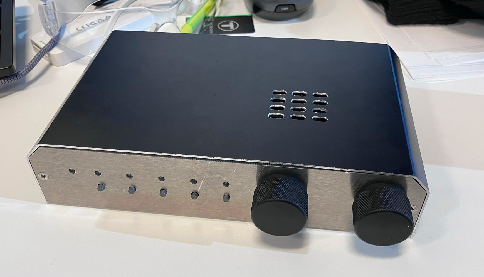
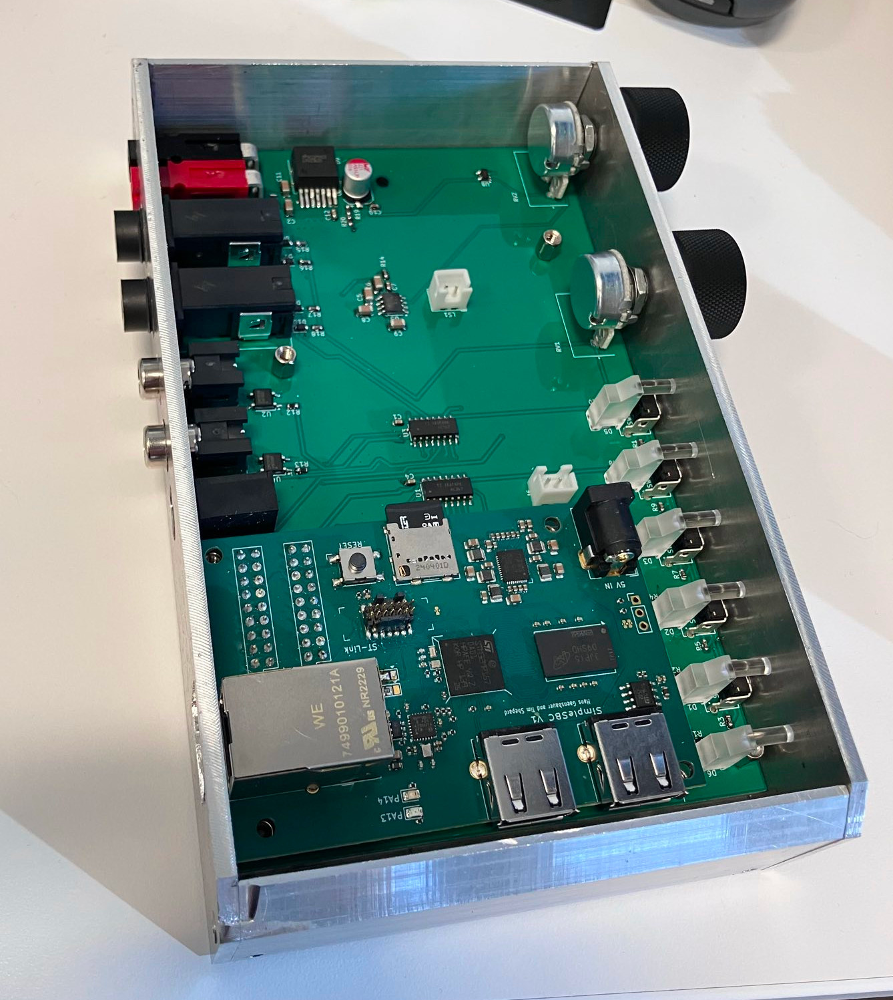
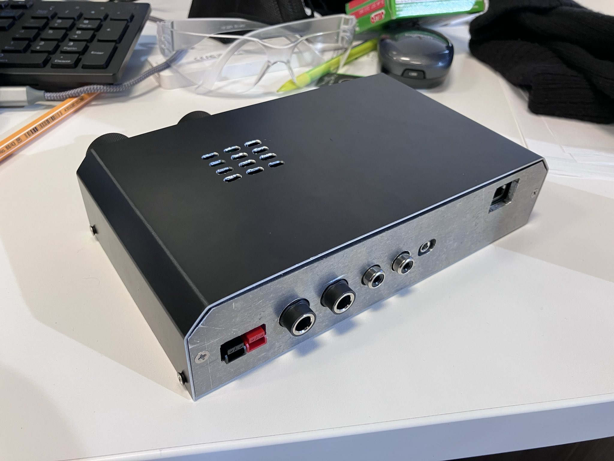

# Linux-Keyer
An automatic CW keyer build around the [SimpleSBC](https://github.com/hansgaensbauer/SimpleSBC).

## Features
- 2 Key/Paddle inputs (both keys and paddles supported on both inputs)
- Automatic detection of key wiring
- PTT and Key outputs
- Internal and external speaker support
- Network connectivity (10/100)
- Linux!

<table>
  <tr>
    <td></td>
    <td>
  </tr>
</table>

